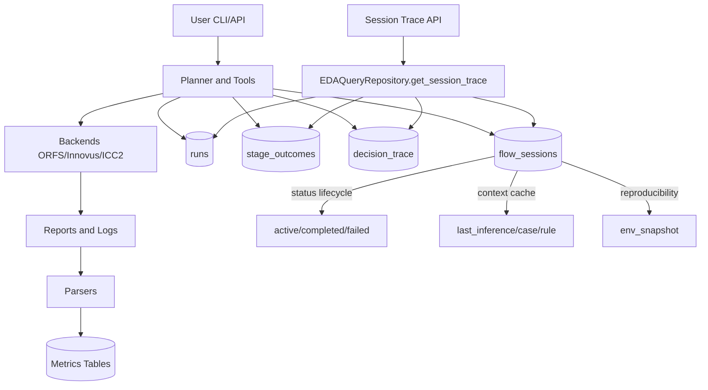
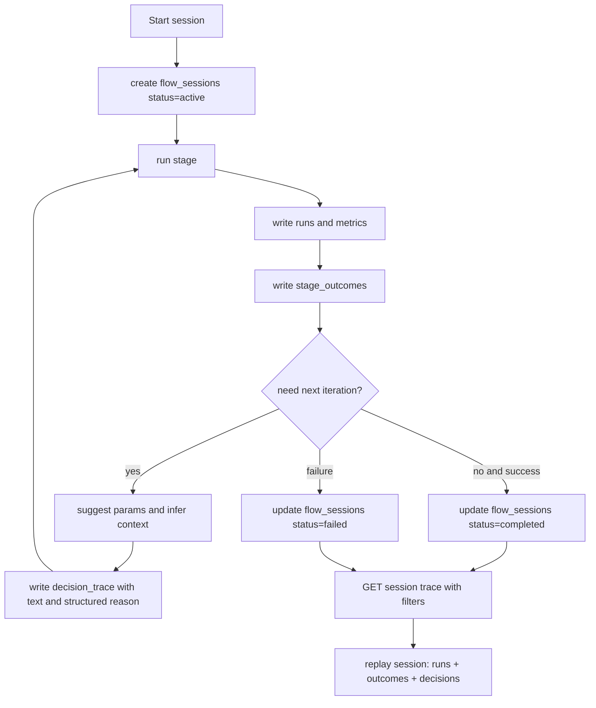

# EDA Agent 技术对比与现状评估（更新于 2026-05-25）

## 1. 项目定位

EDA Agent 是一个面向数字后端优化的 LLM 驱动系统，目标是把“诊断 -> 建议 -> 重跑 -> 评估 -> 沉淀”的工程闭环标准化、可追溯、可复现。

当前实现已形成 **Planner + Tools + Backend + Parser + DB + Session Lineage** 主链路，并具备可运行的推理与调参闭环。

## 2. 当前架构快照

```
eda_agent/
├── backends/      # ORFS / Innovus / ICC2(未实现)
├── parsers/       # timing / power / congestion / drc / utilization / innovus 扩展解析
├── db/            # SQLAlchemy + Alembic + repository + lineage schema
├── agent/         # planner / tools / inference / memory / guardrails / subagents
├── api/           # FastAPI + JWT + runs/metrics/agent 路由
└── queue/         # 异步任务队列与 worker（本地 SQLite job store）
```

### 闭环主路径

1. Planner/Tools 发起 `run_eda_stage` / `run_eda_flow` / `tune_ppa*`
2. backend 执行 stage，产出 logs/reports
3. parser 将报告规范化并写入 metrics 表
4. 写入 lineage：`flow_sessions`、`stage_outcomes`、`decision_trace`
5. inference + case memory 提供根因候选与经验复用
6. API/CLI 查询会话轨迹与 QoR 对比

### 当前架构示意图



## 3. 与 v3 设计文档差距（按当前代码更新）

| 能力项 | v3 目标 | 当前状态 | 结论 |
|---|---|---|---|
| ReAct Planner 闭环 | observe→diagnose→act→learn | `Planner` + `TOOL_SCHEMAS` + memory 已形成闭环 | ✅ |
| Session 级生命周期 | 会话级追踪与状态管理 | `flow_sessions` + `stage_outcomes` + `decision_trace` 已落地 | ✅ |
| Root Cause Inference | 可解释根因推断 | `inference engine/rules/weights/confirm` 已实现 | ✅（规则驱动） |
| Case Memory | 历史案例复用 | `case_memory` 持久化 + `search_similar_cases` 已接入 planner | ✅ |
| Guardrails + HITL | 风险动作受控执行 | guardrails block/warn + 明确确认流程已实现 | ✅（基础策略） |
| Multi-Agent 协作 | 专职 agent 实际分工 | 有 subagent 框架，但 PnR/STA/Signoff/Experiment 仍为 skeleton | ⚠️ |
| Knowledge Graph | 参数-现象-结构图谱推理 | 未见独立图谱存储/查询/推理模块 | ❌ |
| Recipe Search（Bayes/RL） | 系统化搜索策略 | 当前主要 rule + LLM 建议 + 迭代执行 | ⚠️ |
| UI 产品层 | dashboard / explorer / tracker | 目前为 API + CLI，未形成独立 UI 产品层 | ⚠️ |

## 4. 本轮关键落地（截至当前实现）

### P1: 执行与编排能力增强

- `run_eda_stage` / `run_eda_flow` 已支持同步与异步提交路径
- 引入 `submit_job/job_status/job_logs/cancel_job`，支持后台任务跟踪
- 调参环路覆盖单阶段与多阶段：`tune_ppa` / `tune_ppa_multistage`

### P2: Session-lineage 可追溯性增强

- Session 主表：`flow_sessions`（状态、上下文、环境快照）
- 阶段快照：`stage_outcomes`
- 决策链：`decision_trace`（含结构化 reason 字段）
- 支持 `GET /runs/sessions/{session_id}/trace` 过滤查询

### P3: 推理与经验沉淀增强

1. 根因推理链路
   - `infer_root_cause` 生成 hypotheses + evidence + experiments
   - `confirm_root_cause` 反馈确认并更新 rule weights

2. Case memory 复用
   - 推理确认可沉淀 case
   - planner 会注入相似历史案例辅助后续决策

3. 风险控制
   - 高风险操作阻断并要求人工确认
   - 对极端参数给出 warn/block 防护

### 调参与追踪流程示意图（session-lineage）



## 5. 数据平台能力对比（更新版）

### EDA Agent 当前优势

- EDA 领域模型明确：design/run/session/lineage 闭环完整
- 执行后自动解析入库，支持 timing/power/congestion/drc/utilization
- 具备根因推理、案例记忆、风险拦截与会话回放能力
- API 与 CLI 双入口，便于自动化集成

### 与通用数据平台（如 JedAI）差异

| 维度 | JedAI 类平台 | EDA Agent |
|---|---|---|
| 目标 | 通用数据治理/探索/分析 | EDA 调参与根因诊断闭环 |
| 数据组织 | 数据集/目录中心 | 设计-run-session-lineage |
| 入库方式 | ETL/作业平台驱动 | backend 执行后自动解析入库 |
| 权限体系 | 完整 RBAC/组织级治理 | JWT + 基础用户模型 |
| 计算与调度 | 集群/大数据作业优先 | OLTP + 本地异步队列（SQLite job store） |

## 6. 与传统参数优化（TPE/Bayesian）对比

| 维度 | TPE/Bayesian | EDA Agent（LLM+规则） |
|---|---|---|
| 搜索方式 | 数学采样与概率建模 | 语义推理 + 规则引导 + 历史案例 |
| 可解释性 | 统计指标可解释 | 决策链可解释（evidence/reason/trace） |
| 场景适配 | 固定参数空间强 | 非结构化问题与诊断场景更灵活 |
| 知识复用 | trial 历史 | case memory + decision trace + session context |

结论：两者互补，适合演进为“Bayes 候选生成 + Agent 语义筛选与执行”的协同架构。

## 7. 当前成熟度评估

### 已成熟

- 多 backend 抽象与执行工具链（ORFS + Innovus）
- 指标解析与结构化入库
- Session-lineage 回放与过滤查询
- 根因推理、案例沉淀、guardrails 基础闭环

### 待增强

- Multi-agent 从 skeleton 升级为真实职责协作
- Knowledge Graph/因果图谱与图查询能力
- Recipe Search 的 Bayes/RL 搜索器
- API 到 UI 的产品化视图层（dashboard/experiment tracker）
- `agent/tools.py` 等大文件的模块化拆分与边界收敛

## 8. 推荐下一阶段优先级

1. 多 Agent 实体化
   - 让 PnR/STA/Signoff/Experiment 子代理接入真实分析与决策输入输出协议

2. 搜索策略升级
   - 在 `suggest_params` 前接入轻量 Bayes/TPE 候选生成，再由 Agent 解释筛选

3. 图谱层建设
   - 引入 violation-phenomenon-parameter 的图谱建模与可查询因果链

4. 可观测性与产品化
   - 增加 session 聚合统计视图（阶段耗时、成功率、收益分布）
   - 在 API 基础上补齐 QoR/实验追踪 UI 面板

5. 工程质量提升
   - 拆分超大模块（如 `agent/tools.py`）并加强类型化边界

## 9. 关键结论

相对 v3 目标，EDA Agent 已从“概念原型”进入“可执行、可追溯、可复盘”的工程化阶段。

当前最主要差距在：

- 智能层深度（KG + Recipe Search）
- 多 Agent 实体化协作
- 产品层可视化与工程解耦

整体判断：**主干能力已具备，进入“补齐智能层与架构收敛”的阶段。**
