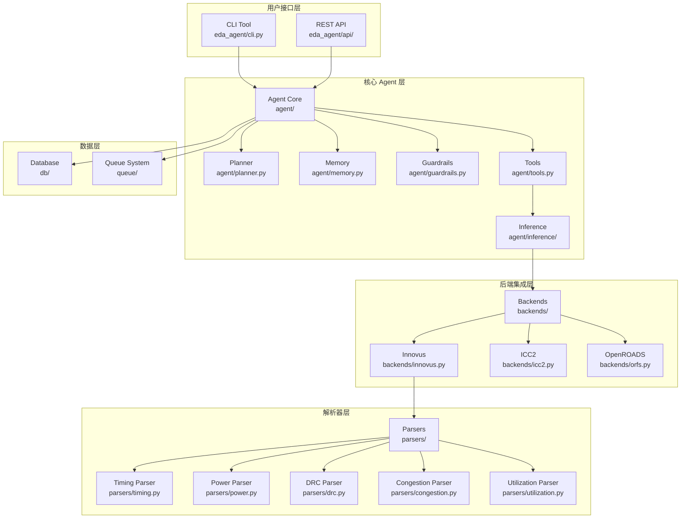
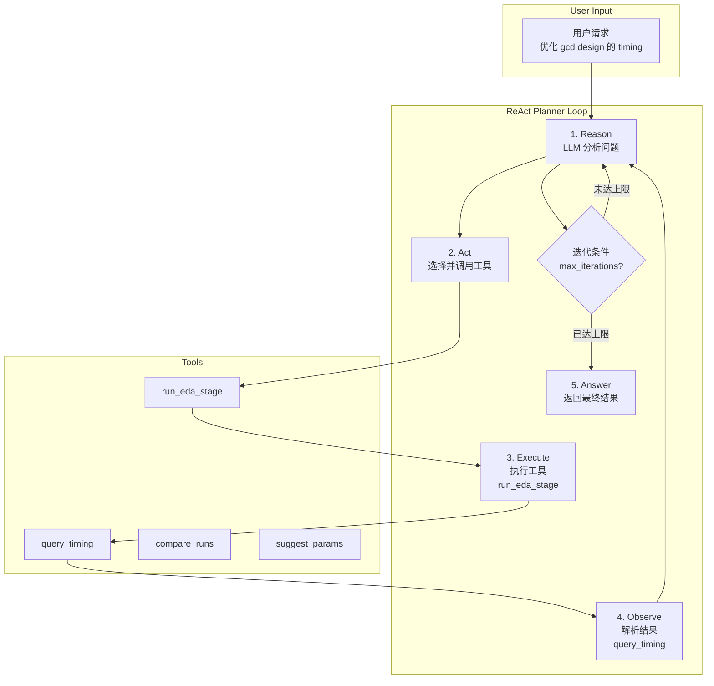
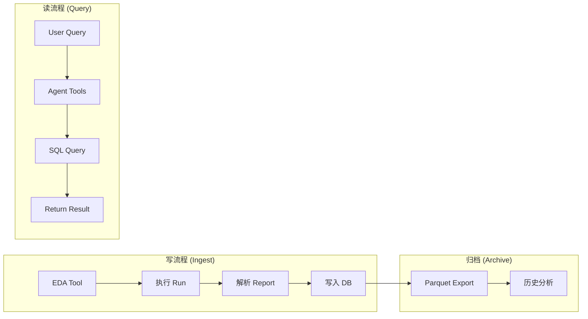

# EDA Agent 技术对比分析

## 1. 项目定位

**EDA Agent** 是一个基于大语言模型（LLM）的 EDA 设计自动化 agent，专注于 PPA（功耗-性能-面积）优化和参数调优。

## 2. 系统架构

```
eda_agent/
├── backends/      # AbstractEDABackend + ORFS / Innovus / ICC2
├── parsers/       # Timing / congestion / utilization report parsers
├── db/            # SQLAlchemy + GeoAlchemy2 schema, Alembic migrations, Parquet archiver
├── agent/         # MiniMax ReAct planner, tool registry, session memory
├── api/           # FastAPI multi-user service with JWT auth
└── config.py      # Unified settings via pydantic-settings
```

### ReAct Planner 工作流程

1. **Reason**: LLM 分析当前设计状态
2. **Act**: 选择工具（如 `suggest_params`）
3. **Execute**: 调用 `run_eda_stage` 运行阶段
4. **Observe**: 解析报告，结果反馈给 LLM
5. 迭代直到收敛或达到 `max_iterations`

## 3. 实际使用场景

### 场景 1: Timing 优化

- **目标**: 优化 design 的 setup time
- **流程**:
  1. 查询当前 WNS（Worst Negative Slack）
  2. LLM 分析时序瓶颈路径
  3. 生成 Place 参数建议（如 `PLACE_DENSITY`）
  4. 重新运行 Place + Route
  5. 比较 WNS 改进，若未收敛继续迭代

### 场景 2: Congestion 优化

- **目标**: 解决局部拥塞热点
- **流程**:
  1. 解析 `congestion_map` 报告
  2. 提取热点 bounding box 坐标
  3. LLM 分析拥塞原因
  4. 生成修复参数建议
  5. 重新 Place，验证是否解决

## 4. 与 v3 设计文档的差距

| 特性 | v3 设计 | 当前实现 | 状态 |
|---|---|---|---|
| **多层架构** | UI → Planner → KG → Inference → Primitives → Adapters | CLI/API → Agent → Backends | ✅ |
| **ReAct Planner** | Reason + Act 循环 | MiniMax ReAct Planner | ✅ |
| **Case Memory** | symptom-cause-action-metrics | Session Memory | ✅ |
| **Guardrails** | 风险操作拦截 + 人类确认 | 基础 Risk Strategy | ⚠️ |
| **多 Agent** | PnR/STA/Signoff/Experiment Agent | 单一 Planner | ⚠️ |
| **Knowledge Graph** | 物理现象-参数-设计结构图 | ❌ | ❌ |
| **Root Cause Inference** | 特征提取 + 因果推理规则 | ❌ | ❌ |
| **Recipe Search** | Bayesian/RL 参数搜索 | ❌ | ❌ |

## 5. 与 ME (TPE) 工具对比

| 维度 | ME (TPE) | EDA Agent (LLM) |
|---|---|---|
| **优化方法** | TPE/Bayesian 优化 | LLM ReAct 推理 |
| **参数选择** | 数学建模 + Optuna | 自然语言推理 |
| **上下文理解** | 数值特征 | 语义理解 |
| **根因分析** | 回归模型 | LLM 推理 |
| **灵活扩展** | 参数需预先定义 | NLP 自然扩展 |
| **多目标** | Pareto 前沿 | LLM 多目标权衡 |
| **知识复用** | Trial 历史 | Case Memory |
| **成本** | 计算密集 | API 调用 |

**结论**: ME 适合固定参数空间的数值优化，EDA Agent 适合复杂场景推理。两者可互补。

## 6. 与 JedAI Platform 数据库设计对比

### JedAI Platform

| 特性 | 设计 |
|---|---|
| **存储** | NFS / 本地文件系统 |
| **元数据** | Catalog Service 管理 |
| **分析引擎** | Pandas / Spark ETL |
| **权限模型** | Role-Entity-Policy (完整) |
| **数据注册** | 通过 Catalog API 手动注册 |
| **大规模分析** | Spark 分布式计算 |
| **特点** | 通用数据平台，非 EDA 专用 |

### EDA Agent

| 特性 | 设计 |
|---|---|
| **存储** | PostgreSQL + Parquet |
| **元数据** | SQLAlchemy ORM 模型 |
| **解析器** | 结构化 report → dict |
| **权限** | 基础 JWT |
| **数据注册** | Agent 自动解析入库 |
| **大规模分析** | 本地 Parquet 查询 |
| **特点** | EDA 专用，���动化程度高 |

### 关键差异

| 维度 | JedAI | EDA Agent |
|---|---|---|
| **数据模型** | 通用数据集 | PPA 指标专用 |
| **自动解析** | 手动上传 | Agent 自动调用解析器 |
| **权限体系** | 完整 RBAC | 基础 JWT |
| **扩展性** | Catalog API | 代码级扩展 ORM |
| **场景** | 通用分析 | 自动调参优化 |

## 7. 技术亮点

1. **ReAct Planner** - LLM 自主决策调整策略
2. **多维度解析器** - 支持 Timing、Power、DRC、Congestion、Utilization
3. **Session Memory** - 记住历史调参经验
4. **Guardrails** - 安全约束，防止破坏性操作
5. **Parquet 归档** - 高效存储历史数据

## 8. 路线图

| Phase | 目标 | 状态 |
|---|---|---|
| Phase 1 | ORFS gcd demo → 解析 → 入库 | ✅ |
| Phase 2 | CLI Agent MVP (query/compare) | ✅ |
| Phase 3 | 自主调参闭环 | 🔄 |
| Phase 4 | FastAPI + 多后端生产 | 📋 |

## 9. 完整架构图



## 10. ReAct Planner 工作流程图



## 11. 推荐优先级

### 高优先级
- Knowledge Graph + Root Cause Inference（核心价值）

### 中优先级
- 多 Agent 协作 + Recipe Search（扩展能力）

### 低优先级
- 可视化面板（展示用）

## 12. 数据库架构

### 核心表结构

| 表名 | 说明 |
|---|---|
| `backends` | EDA 后端注册 (ORFS/Innovus/ICC2) |
| `designs` | RTL 设计元数据 |
| `runs` | 流程执行记录 |
| `timing_summary` | 时序汇总 (WNS/TNS/FEP) |
| `timing_paths` | 时序违例路径 |
| `congestion_hotspots` | 拥塞热点 (PostGIS) |
| `utilization_summary` | 利用率汇总 |
| `power_summary` | 功耗分解 |
| `drc_violations` | DRC 违例 |
| `artifacts` | 产物文件 |
| `agent_sessions` | Agent 对话历史 |

### ER 关系图


### 读写流程



### 关键技术点

1. **SQLAlchemy ORM** — 声明式数据模型
2. **JSONB** — 灵活存储 params 配置
3. **PostGIS** — 拥塞热点空间查询
4. **Parquet** — 大规模历史数据归档

## 13. 技术壁垒与卖点

### 核心卖点

| 卖点 | 说明 |
|---|---|
| **自动化** | LLM 替代人工编写 TCL 脚本 |
| **可追溯** | PostgreSQL 全程记录 PPA 指标 |
| **可扩展** | 后端抽象层支持多 EDA 工具 |

### 技术壁垒

#### 1. 解析器层（高壁垒）

| 壁垒 | 说明 |
|---|---|
| **多格式解析** | Innovus timing/power/drc/congestion 报告解析需大量正则工程 |
| **结构化输出** | 解析结果直接入库，需精确的数据模型映射 |
| **容错能力** | 报告格式变化时的鲁棒性 |

```
eda_agent/parsers/
├── innovus_timing.py      # timing 报告解析
├── innovus_power.py       # power 报告解析
├── innovus_drc.py         # DRC 解析
└── innovus_congestion_map.py  # 拥塞热点解析
```

#### 2. ReAct Planner（中壁垒）

| 壁垒 | 说明 |
|---|---|
| **Tool Schema** | 工具调用需精确定义 JSON Schema |
| **Context 管理** | Session Memory 记忆上下文 |
| **迭代收敛** | max_iterations 策略控制 |

#### 3. 后端抽象层（中壁垒）

| 壁垒 | 说明 |
|---|---|
| **AbstractEDABackend** | 统一接口适配多后端 |
| **Remote SSH** | 远程调度 + 日志拉回 |
| **状态机** | StageStatus 状态管理 |

#### 4. 数据模型（低壁垒）

| 壁垒 | 说明 |
|---|---|
| **SQLAlchemy ORM** | 标准化模型定义 |
| **PostGIS** | 拥塞热点空间存储 |
| **Parquet Archive** | 大规模历史数据归档 |
