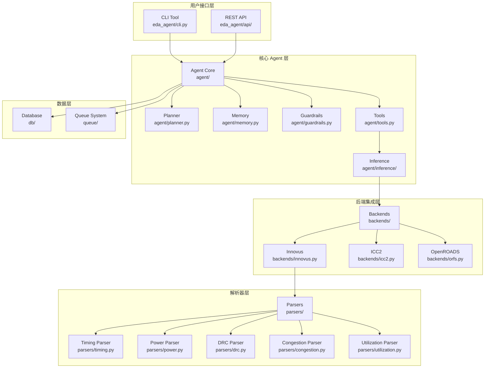
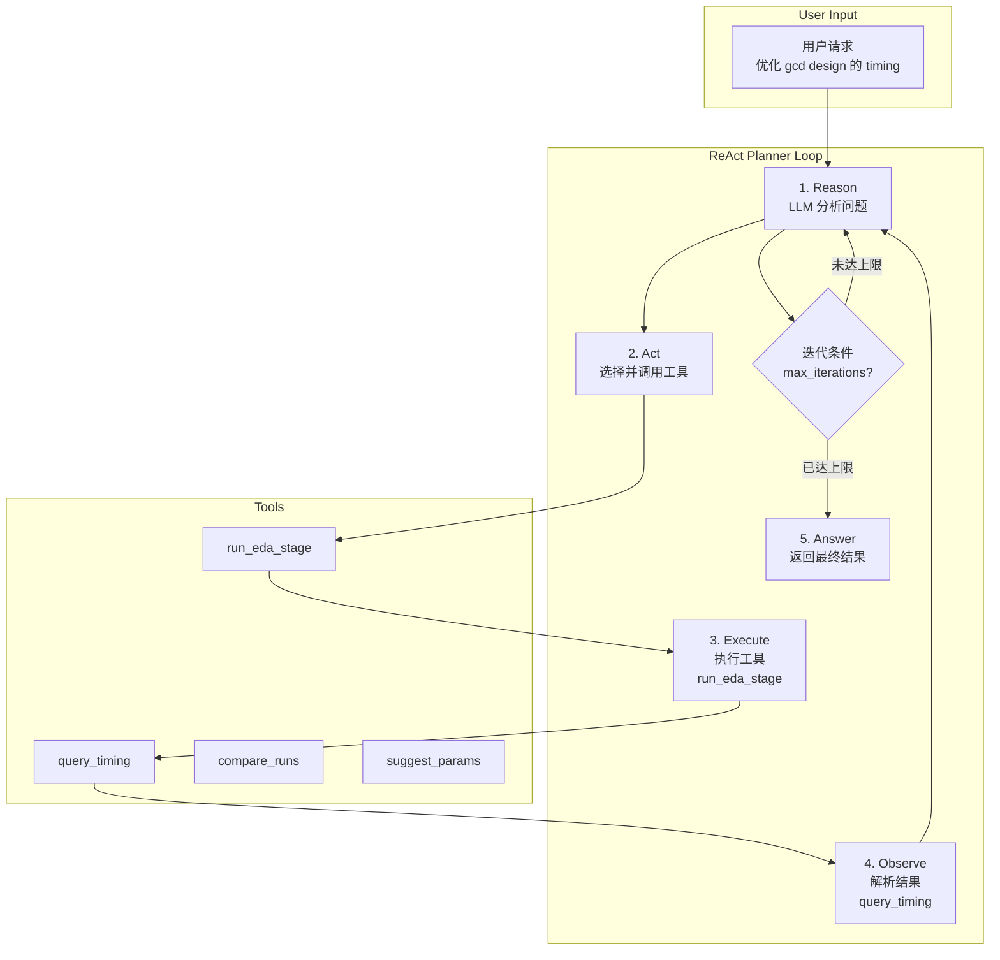
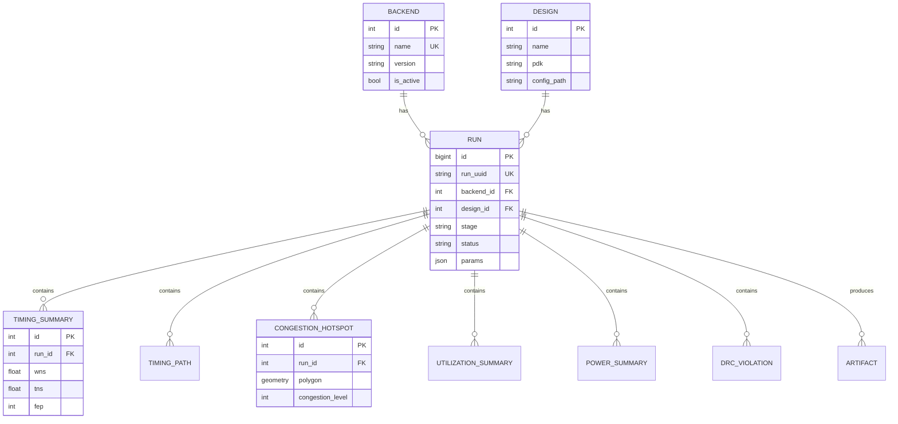
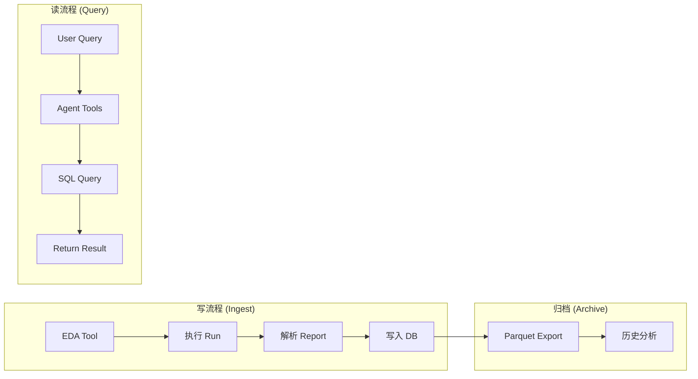
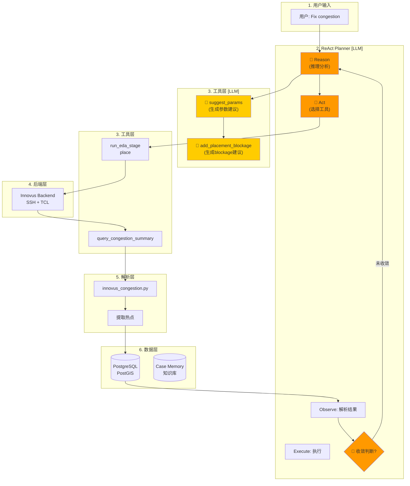
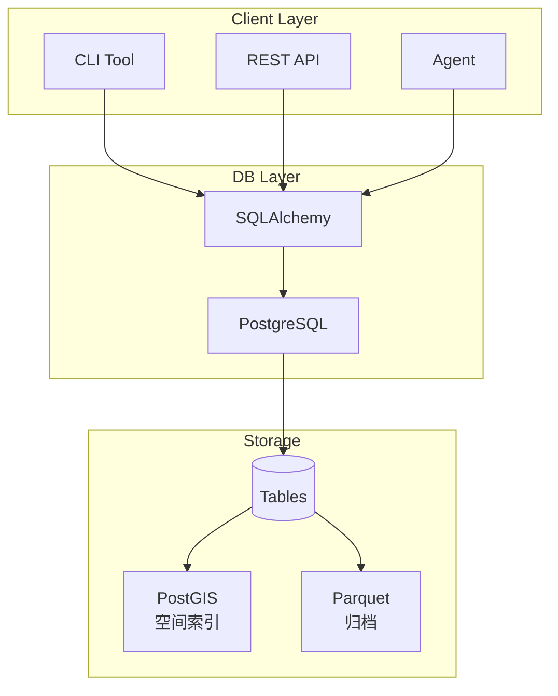

# EDA Agent 技术对比分析

## 1. 项目定位

**EDA Agent** 是一个基于大语言模型（LLM）的 EDA 设计自动化 agent，专注于 PPA（功耗-性能-面积）优化和参数调优。

## 2. 系统架构

```
eda_agent/
├── backends/      # AbstractEDABackend + ORFS / Innovus / ICC2
├── parsers/       # Timing / congestion / utilization report parsers
├── db/            # SQLAlchemy + GeoAlchemy2 schema, Alembic migrations, Parquet archiver
├── agent/         # MiniMax ReAct planner, tool registry, session memory
├── api/           # FastAPI multi-user service with JWT auth
└── config.py      # Unified settings via pydantic-settings
```

### ReAct Planner 工作流程

1. **Reason**: LLM 分析当前设计状态
2. **Act**: 选择工具（如 `suggest_params`）
3. **Execute**: 调用 `run_eda_stage` 运行阶段
4. **Observe**: 解析报告，结果反馈给 LLM
5. 迭代直到收敛或达到 `max_iterations`

## 3. 实际使用场景

### 场景 1: Timing 优化

- **目标**: 优化 design 的 setup time
- **流程**:
  1. 查询当前 WNS（Worst Negative Slack）
  2. LLM 分析时序瓶颈路径
  3. 生成 Place 参数建议（如 `PLACE_DENSITY`）
  4. 重新运行 Place + Route
  5. 比较 WNS 改进，若未收敛继续迭代

### 场景 2: Congestion 优化

- **目标**: 解决局部拥塞热点
- **流程**:
  1. 解析 `congestion_map` 报告
  2. 提取热点 bounding box 坐标
  3. LLM 分析拥塞原因
  4. 生成修复参数建议
  5. 重新 Place，验证是否解决

## 4. 与 v3 设计文档的差距

| 特性 | v3 设计 | 当前实现 | 状态 |
|---|---|---|---|
| **多层架构** | UI → Planner → KG → Inference → Primitives → Adapters | CLI/API → Agent → Backends | ✅ |
| **ReAct Planner** | Reason + Act 循环 | MiniMax ReAct Planner | ✅ |
| **Case Memory** | symptom-cause-action-metrics | Session Memory | ✅ |
| **Guardrails** | 风险操作拦截 + 人类确认 | 基础 Risk Strategy | ⚠️ |
| **多 Agent** | PnR/STA/Signoff/Experiment Agent | 单一 Planner | ⚠️ |
| **Knowledge Graph** | 物理现象-参数-设计结构图 | ❌ | ❌ |
| **Root Cause Inference** | 特征提取 + 因果推理规则 | ❌ | ❌ |
| **Recipe Search** | Bayesian/RL 参数搜索 | ❌ | ❌ |

## 5. 与 ME (TPE) 工具对比

| 维度 | ME (TPE) | EDA Agent (LLM) |
|---|---|---|
| **优化方法** | TPE/Bayesian 优化 | LLM ReAct 推理 |
| **参数选择** | 数学建模 + Optuna | 自然语言推理 |
| **上下文理解** | 数值特征 | 语义理解 |
| **根因分析** | 回归模型 | LLM 推理 |
| **灵活扩展** | 参数需预先定义 | NLP 自然扩展 |
| **多目标** | Pareto 前沿 | LLM 多目标权衡 |
| **知识复用** | Trial 历史 | Case Memory |
| **成本** | 计算密集 | API 调用 |

**结论**: ME 适合固定参数空间的数值优化，EDA Agent 适合复杂场景推理。两者可互补。

## 6. 与 JedAI Platform 数据库设计对比

### JedAI Platform

| 特性 | 设计 |
|---|---|
| **存储** | NFS / 本地文件系统 |
| **元数据** | Catalog Service 管理 |
| **分析引擎** | Pandas / Spark ETL |
| **权限模型** | Role-Entity-Policy (完整) |
| **数据注册** | 通过 Catalog API 手动注册 |
| **大规模分析** | Spark 分布式计算 |
| **特点** | 通用数据平台，非 EDA 专用 |

### EDA Agent

| 特性 | 设计 |
|---|---|
| **存储** | PostgreSQL + Parquet |
| **元数据** | SQLAlchemy ORM 模型 |
| **解析器** | 结构化 report → dict |
| **权限** | 基础 JWT |
| **数据注册** | Agent 自动解析入库 |
| **大规模分析** | 本地 Parquet 查询 |
| **特点** | EDA 专用，���动化程度高 |

### 关键差异

| 维度 | JedAI | EDA Agent |
|---|---|---|
| **数据模型** | 通用数据集 | PPA 指标专用 |
| **自动解析** | 手动上传 | Agent 自动调用解析器 |
| **权限体系** | 完整 RBAC | 基础 JWT |
| **扩展性** | Catalog API | 代码级扩展 ORM |
| **场景** | 通用分析 | 自动调参优化 |

## 7. 技术亮点

1. **ReAct Planner** - LLM 自主决策调整策略
2. **多维度解析器** - 支持 Timing、Power、DRC、Congestion、Utilization
3. **Session Memory** - 记住历史调参经验
4. **Guardrails** - 安全约束，防止破坏性操作
5. **Parquet 归档** - 高效存储历史数据

## 8. 路线图

| Phase | 目标 | 状态 |
|---|---|---|
| Phase 1 | ORFS gcd demo → 解析 → 入库 | ✅ |
| Phase 2 | CLI Agent MVP (query/compare) | ✅ |
| Phase 3 | 自主调参闭环 | 🔄 |
| Phase 4 | FastAPI + 多后端生产 | 📋 |

## 9. 完整架构图



## 10. ReAct Planner 工作流程图



## 11. 推荐优先级

### 高优先级
- Knowledge Graph + Root Cause Inference（核心价值）

### 中优先级
- 多 Agent 协作 + Recipe Search（扩展能力）

### 低优先级
- 可视化面板（展示用）

## 12. 数据库架构

### 核心表结构

| 表名 | 说明 |
|---|---|
| `backends` | EDA 后端注册 (ORFS/Innovus/ICC2) |
| `designs` | RTL 设计元数据 |
| `runs` | 流程执行记录 |
| `timing_summary` | 时序汇总 (WNS/TNS/FEP) |
| `timing_paths` | 时序违例路径 |
| `congestion_hotspots` | 拥塞热点 (PostGIS) |
| `utilization_summary` | 利用率汇总 |
| `power_summary` | 功耗分解 |
| `drc_violations` | DRC 违例 |
| `artifacts` | 产物文件 |
| `agent_sessions` | Agent 对话历史 |

### ER 关系图



### 读写流程



### 关键技术点

1. **SQLAlchemy ORM** — 声明式数据模型
2. **JSONB** — 灵活存储 params 配置
3. **PostGIS** — 拥塞热点空间查询
4. **Parquet** — 大规模历史数据归档

## 14. Congestion 优化完整工作流

### 场景：通过 CLI 修复 Innovus Place 阶段拥塞

**用户命令示例**：
```
eda-agent> Fix the congestion issues in my design after place stage
```

### 完整流程图



### LLM 工作原理

#### 1. Reason（推理分析）

LLM 分析当前拥塞报告，生成诊断结论：

```
prompt: """
Based on the following congestion report:
- total_overflow: 15%
- max_overflow: 23%
- hotspot_count: 5
- hotspot locations: [(100,100)-(150,150)], [(200,200)-(250,250)]

分析热点分布和原因，给出诊断结论。
"""
```

**LLM 输出**：
```
诊断结论:
- 热点集中在右上角区域 (200,200)-(250,250)
- overflow 达到 23%，表明 routing 资源不足
- 可能原因:
  1. PLACE_DENSITY 过高 (当前 0.7)
  2. 局部 cell 密度过高
建议: 降低 PLACE_DENSITY 到 0.5，添加 partial blockage
```

#### 2. Act（选择工具）

LLM 决策下一步行动：

| 当前状态 | 策略 |
|---|---|
| 拥塞 > 15% | 运行 place → query → 分析 |
| 拥塞 5-15% | suggest_params 调参 |
| 拥塞 < 5% | 收敛，停止 |

**策略选择 Prompt**：
```
当前拥塞: max_overflow=23%
目标: max_overflow < 5%

可选行动:
1. add_placement_blockage - 添加 blockage
2. suggest_params - 调整参数
3. tune_congestion_with_blockage - 自动迭代

决策: 选择 suggest_params
```

#### 3. 参数建议生成

LLM 根据历史案例和知识库生成参数：

```python
def _suggest_params(run_id: int, target_spec: str) -> dict:
    # 1. 查询历史案例
    cases = query_case_memory(symptoms="congestion")
    
    # 2. 查询当前运行数据
    current = query_congestion_summary(run_id)
    
    # 3. LLM 生成建议
    prompt = f"""
    当前拥塞: {current}
    历史案例: {cases[:3]}
    目标: {target_spec}
    
    请建议Innovus place参数来降低拥塞。
    返回JSON: {{"PLACE_DENSITY": 0.5, "CELL_PAD_IN_SITES": 2}}
    """
    
    return llm.generate(prompt)
```

#### 4. 收敛判断

LLM 判断是否达到目标：

```python
# 收敛判断逻辑
def check_convergence(congestion: dict, threshold: float = 5.0) -> bool:
    # 方法1: 数值判断
    if congestion["max_overflow"] <= threshold:
        return True
    
    # 方法2: LLM 判断趋势
    prompt = f"""
    当前: max_overflow={congestion['max_overflow']}%
    之前: max_overflow=23%
    趋势: 下降中 (23% → 15% → 8%)
    
    是否应该收敛? 返回 YES 或 NO
    """
    
    result = llm.generate(prompt)
    return result.upper() == "YES"
```

#### 5. 与知识库结合

```python
# 保存调试案例
save_case(
    design_name="gcd",
    pdk="tsmc18",
    symptoms="右上角区域拥塞23%",
    root_cause="PLACE_DENSITY=0.7过高",
    actions=["降低PLACE_DENSITY到0.5", "添加partial blockage"],
    result_metrics={"overflow_before": 23, "overflow_after": 3}
)

# 检索相似案例
case = query_case_memory(
    symptoms="corner congestion",
    design="gcd",
    pdk="tsmc18"
)
# 返回: "之前用PLACE_DENSITY=0.5 + blockage解决过"
```

### LLM 工作流程总结

| 步骤 | LLM 参与 | 产出 |
|---|---|---|
| 1. Reason | ✅ | 诊断结论 |
| 2. Act | ✅ | 策略选择 |
| 3. suggest_params | ✅ | 参数建议 |
| 4. add_placement_blockage | ✅ | blockage 坐标 |
| 5. 收敛判断 | ✅ | YES/NO |
| 6. 知识库检索 | ✅ | 历史案例 |

## 13. 技术壁垒与卖点

### 核心卖点

| 卖点 | 说明 |
|---|---|
| **自动化** | LLM 替代人工编写 TCL 脚本 |
| **可追溯** | PostgreSQL 全程记录 PPA 指标 |
| **可扩展** | 后端抽象层支持多 EDA 工具 |

### 技术壁垒

#### 1. 解析器层（高壁垒）

| 壁垒 | 说明 |
|---|---|
| **多格式解析** | Innovus timing/power/drc/congestion 报告解析需大量正则工程 |
| **结构化输出** | 解析结果直接入库，需精确的数据模型映射 |
| **容错能力** | 报告格式变化时的鲁棒性 |

```
eda_agent/parsers/
├── innovus_timing.py      # timing 报告解析
├── innovus_power.py       # power 报告解析
├── innovus_drc.py         # DRC 解析
└── innovus_congestion_map.py  # 拥塞热点解析
```

#### 2. ReAct Planner（中壁垒）

| 壁垒 | 说明 |
|---|---|
| **Tool Schema** | 工具调用需精确定义 JSON Schema |
| **Context 管理** | Session Memory 记忆上下文 |
| **迭代收敛** | max_iterations 策略控制 |

#### 3. 后端抽象层（中壁垒）

| 壁垒 | 说明 |
|---|---|
| **AbstractEDABackend** | 统一接口适配多后端 |
| **Remote SSH** | 远程调度 + 日志拉回 |
| **状态机** | StageStatus 状态管理 |

#### 4. 数据模型（低壁垒）

| 壁垒 | 说明 |
|---|---|
| **SQLAlchemy ORM** | 标准化模型定义 |
| **PostGIS** | 拥塞热点空间存储 |
| **Parquet Archive** | 大规模历史数据归档 |

## 15. 数据库架构详解

### 技术选型

| 组件 | 选型 | 理由 |
|---|---|---|
| **OLTP** | PostgreSQL | 结构化 PPA 指标存储，ACID 事务 |
| **空间** | PostGIS | 拥塞热点空间查询 |
| **ORM** | SQLAlchemy 2.0 | 声明式模型，类型安全 |
| **归档** | Parquet | 大规模分析查询 |
| **迁移** | Alembic | 版本控制 |

### 核心架构



### 表结构详解

```python
# eda_agent/db/schema.py

class Backend(Base):
    """EDA 后端注册"""
    id: int = mapped_column(Integer, primary_key=True)
    name: str = mapped_column(String(64), unique=True)  # orfs, innovus, icc2
    version: str = mapped_column(String(128))
    is_active: bool = mapped_column(Boolean, default=True)

class Design(Base):
    """RTL 设计"""
    id: int = mapped_column(Integer, primary_key=True)
    name: str = mapped_column(String(256))  # gcd, aes, etc.
    pdk: str = mapped_column(String(128))  # tsmc18, sky130hd
    config_path: str
    rtl_hash: str  # design version

class Run(Base):
    """流程执行"""
    id: int = mapped_column(BigInteger, primary_key=True)
    run_uuid: str = mapped_column(String(36), unique=True)
    backend_id: int = mapped_column(ForeignKey("backends.id"))
    design_id: int = mapped_column(ForeignKey("designs.id"))
    stage: str  # place, cts, route, finish
    status: str  # pending, running, success, failed
    params: dict = mapped_column(JSONB)  # EDA parameters
    log_path: str
    report_dir: str

class TimingSummary(Base):
    """时序汇总"""
    run_id: int = mapped_column(ForeignKey("runs.id"))
    wns_ns: float  # Worst Negative Slack
    tns_ns: float  # Total Negative Slack
    failing_endpoints: int
    fmax_mhz: float

class CongestionHotspot(Base):
    """拥塞热点"""
    run_id: int = mapped_column(ForeignKey("runs.id"))
    geom: Geometry  # PostGIS POLYGON
    overflow: int  # overflow percentage
    layer: str  # routing layer
```

### 可扩展性设计

#### 1. 连接池配置

```python
# eda_agent/db/session.py

_engine = create_engine(
    settings.database_url,
    pool_pre_ping=True,
    pool_size=10,      # 基础连接数
    max_overflow=20,    # 最大溢出
)
```

#### 2. 索引策略

```sql
-- runs 表索引
CREATE INDEX ix_runs_backend_design_stage ON runs(backend_id, design_id, stage);
CREATE INDEX ix_runs_status ON runs(status);
CREATE INDEX ix_runs_created_at ON runs(created_at);

-- PostGIS 空间索引
CREATE INDEX ix_congestion_geom_gist ON congestion_hotspots USING GIST(geom);

-- JSONB 索引
CREATE INDEX ix_runs_params_gin ON runs USING GIN(params);
```

#### 3. 分区策略

```sql
-- 按时间分区（推荐）
CREATE TABLE runs_new (
    ...
) PARTITION BY RANGE (created_at);

CREATE TABLE runs_2024 PARTITION OF runs_new
    FOR VALUES FROM ('2024-01-01') TO ('2025-01-01');

-- 按 design 分区
CREATE TABLE runs_design gcd PARTITION OF runs_new
    FOR VALUES IN ('gcd');
```

### 与 JedAI 对比

| 维度 | EDA Agent | JedAI Platform |
|---|---|---|
| **数据模型** | PPA 专用 | 通用数据集 |
| **存储格式** | PostgreSQL + Parquet | NFS + Database Catalog |
| **空间查询** | PostGIS 内置 | 需额外配置 |
| **归档** | 自动 Parquet | 手动导出 |
| **权限模型** | 基础 JWT | 完整 RBAC |
| **API** | SQLAlchemy | Catalog API |

### 大规模扩展方案

#### 方案 1: 读写分离

```python
# 只读副本
_engine_read = create_engine(settings.replica_url, pool_size=20)

def get_db_read():
    return Session(engine=_engine_read)

# 写入主库
def get_db_write():
    return Session(engine=_engine)
```

#### 方案 2: 分库分表

```
# 水平分片按 design
shard_1: runs_gcd, runs_aes
shard_2: runs_picorv32, runs_ibex

# 按时间分表
runs_2024Q1, runs_2024Q2, runs_2024Q3
```

#### 方案 3: 异步归档

```python
# 后台任务异步归档
from eda_agent.db.archiver import archive_run

# 避免阻塞主流程
asyncio.create_task(archive_run(run_id))
```

#### 方案 4: 多租户

```sql
-- 添加 tenant_id
ALTER TABLE runs ADD COLUMN tenant_id UUID;
ALTER TABLE designs ADD COLUMN tenant_id UUID;

-- RLS 策略
CREATE POLICY runs_tenant_policy ON runs
    USING (tenant_id = current_setting('app.tenant_id'));
```

### 扩展路径总结

| 阶段 | 数据量 | 方案 |
|---|---|---|
| MVP | < 10万行 | 单实例 PostgreSQL |
| 增长 | 10-100万 | 读写分离 + 索引优化 |
| 规模 | 100-1000万 | 分库分表 + Parquet 归档 |
| 企业 | > 1000万 | 多租户 + Sharding |
