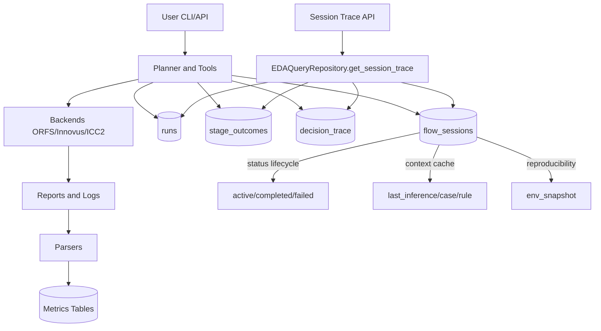
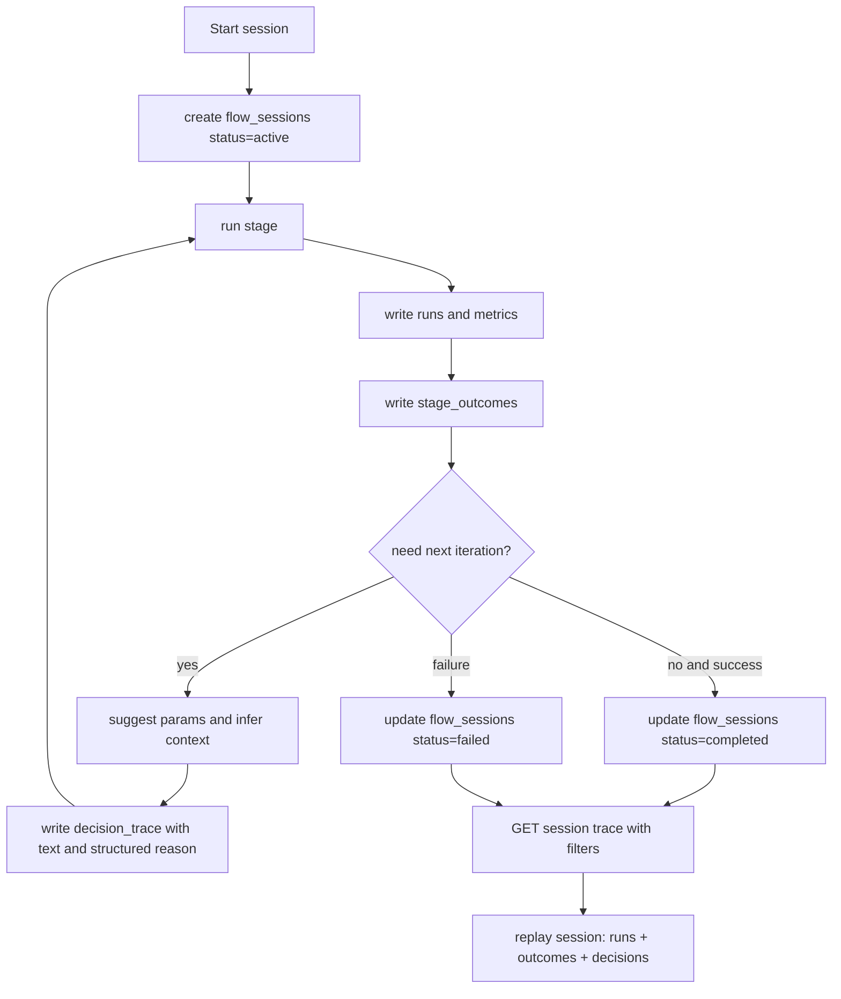

# EDA Agent 技术对比与现状评估（更新于 2026-05-22）

## 1. 项目定位

EDA Agent 是一个面向数字后端优化的 LLM 驱动自动化系统，核心目标是把“诊断 -> 建议 -> 重跑 -> 评估 -> 记录”的闭环标准化、可复现化。

当前系统已经从早期的 run-centric 模式演进到 session-lineage 模式，支持按 session 追踪多阶段执行、决策链与上下文。

## 2. 当前架构快照

```
eda_agent/
├── backends/      # ORFS / Innovus / ICC2 backend 适配
├── parsers/       # timing / power / congestion / drc / utilization
├── db/            # SQLAlchemy + Alembic + repository + archiver
├── agent/         # planner / tools / inference / memory / guardrails
├── api/           # FastAPI + JWT + runs/metrics/agent 路由
└── queue/         # 异步任务调度
```

### 闭环主路径

1. Planner/Tools 发起阶段执行或调参迭代
2. `run_eda_stage` 写入 `runs`
3. 解析报告并写入指标表（timing/power/congestion/...）
4. 同步写入 lineage：`stage_outcomes`、`decision_trace`
5. 按 session 维护上下文与状态（`active/completed/failed`）
6. 通过 API 拉取 session trace 做回放与分析

### 当前架构示意图



## 3. 与 v3 设计文档差距（按当前代码更新）

| 能力项 | v3 目标 | 当前状态 | 结论 |
|---|---|---|---|
| ReAct Planner 闭环 | Reason-Act-Observe 迭代 | 已在工具层形成可执行闭环（含 tune_ppa / multistage） | ✅ |
| Session 级生命周期 | 非 run 级、可追踪完整会话 | `flow_sessions` + 状态机 + stage_seq 已落地 | ✅ |
| 决策链可追溯 | 推理/建议/确认可回放 | `decision_trace` + session trace API 已落地 | ✅ |
| 可复现性 | 过程、参数、环境可复盘 | `stage_outcomes` + `env_snapshot` + structured reason 已落地 | ✅ |
| Root Cause Inference | 可解释因果诊断 | 已有 inference engine/rules + confirm 流程 | ✅（基础版） |
| 多 Agent 协作 | 专职 agent 分工 | 仍以单 planner 为主 | ⚠️ |
| KG/图谱推理 | 参数-现象-结构图谱 | 尚未实现 | ❌ |
| Recipe Search（Bayes/RL） | 系统化搜索策略 | 当前主要是规则/LLM建议 + 迭代 | ⚠️ |

## 4. 本轮关键落地（P1/P2/P3）

### P1: Session Trace 查询增强

API 已支持：

- `GET /runs/sessions/{session_id}/trace`
- 过滤参数：`stage`、`from_seq`、`to_seq`、`human_approved`

对应查询在 repository 中统一聚合返回：

- `session`
- `runs`
- `stage_outcomes`
- `decision_trace`

### P2: Session 生命周期管理

`flow_sessions.status` 已形成真实流转：

- 创建 session 时置为 `active`
- 阶段失败时置为 `failed`
- 最终阶段成功完成时置为 `completed`

同时支持 `baseline_run_id` 回写，便于固化该 session 的代表结果。

### P3: 可复现性增强

1. `flow_sessions.env_snapshot`（JSONB）
   - 记录 python/sqlalchemy/pdk/design/captured_at 等环境信息

2. `decision_trace.llm_reason_structured`（JSONB）
   - 结构化保存建议理由
   - 保留原 `llm_reason` 文本，兼容旧逻辑
   - migration 回填 legacy 文本为结构化对象

3. 最新上下文缓存
   - `flow_sessions.last_inference_id/last_case_id/last_rule_id`
   - 新决策优先读取 session 上下文，减少 run 级回查歧义

### 调参与追踪流程示意图（session-lineage）



## 5. 数据库能力对比（更新版）

### EDA Agent 当前优势

- 领域模型强：围绕 run/session/metrics/lineage 构建
- 自动入库：工具执行后自动解析并落库
- 空间能力：拥塞热点使用 PostGIS
- 可回放：session 级 trace 可聚合拉取
- 可复现：参数快照 + 环境快照 + 结构化理由

### 与通用数据平台（如 JedAI）差异

| 维度 | JedAI 类平台 | EDA Agent |
|---|---|---|
| 目标 | 通用数据治理/分析 | EDA 调参与根因闭环 |
| 数据组织 | 数据集/目录中心 | 设计-run-session-lineage |
| 入库方式 | 手工或 ETL 驱动 | agent 自动执行后入库 |
| 权限体系 | 完整 RBAC/Policy | JWT + 基础用户模型 |
| 计算模式 | Spark/大数据优先 | OLTP + 本地分析/归档 |

## 6. 与传统参数优化（ME/TPE）对比

| 维度 | TPE/Bayesian | EDA Agent（LLM+规则） |
|---|---|---|
| 搜索方式 | 数学采样与概率模型 | 语义推理 + 历史上下文 |
| 可解释性 | 统计可解释 | 决策链可解释（文本+结构化） |
| 场景适配 | 固定参数空间强 | 非结构化问题更灵活 |
| 知识复用 | trial 历史 | case memory + decision trace |

结论：两者不是替代关系，最优形态是“Bayes 搜索器 + Agent 语义编排”协同。

## 7. 当前成熟度评估

### 已成熟

- 多后端抽象 + 工具编排
- 指标解析和结构化入库
- session 级 lineage 与回放
- 非 VM 回归主路径稳定

### 待增强

- 结构化 reason 的查询维度（按 kind/source 聚合）
- session trace 的统计视图（例如 stage 耗时、成功率）
- 多 agent 分工与协作协议
- KG 与 recipe 搜索能力

## 8. 推荐下一阶段优先级

1. 查询增强
   - 为 session trace 增加基于 `llm_reason_structured.kind/source` 的过滤

2. 分析视图
   - 增加 session 级聚合指标（阶段耗时、失败原因分布、改善幅度）

3. 搜索策略升级
   - 在 `suggest_params` 前接入轻量 Bayes/TPE 候选生成，再由 Agent 解释和筛选

4. 多 agent 演进
   - 拆分 diagnosis / execution / evaluation 角色，统一通过 decision trace 交换上下文

## 9. 关键结论

相对最初 v3 gap，这个项目已经跨过“概念原型”阶段，进入“可回放、可复现、可持续迭代”的工程化阶段。

当前最值得继续投入的是：

- 把已有 lineage 数据变成更强的分析/搜索能力
- 把单 planner 升级为可协作的多 agent 框架
